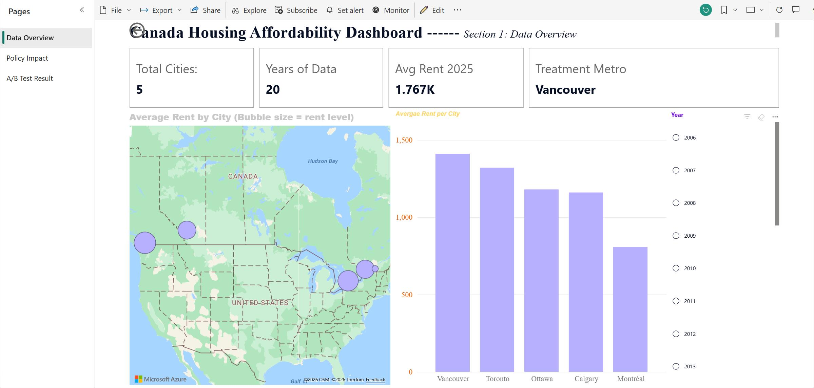
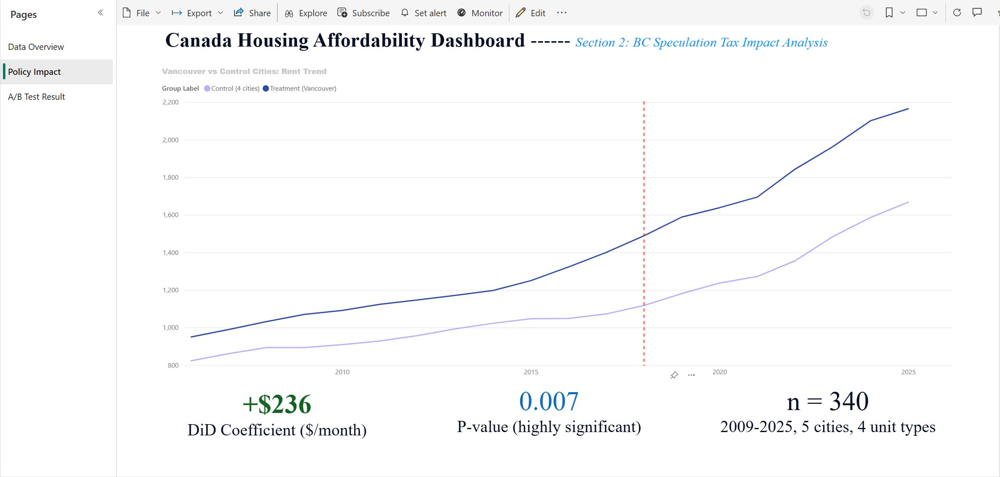
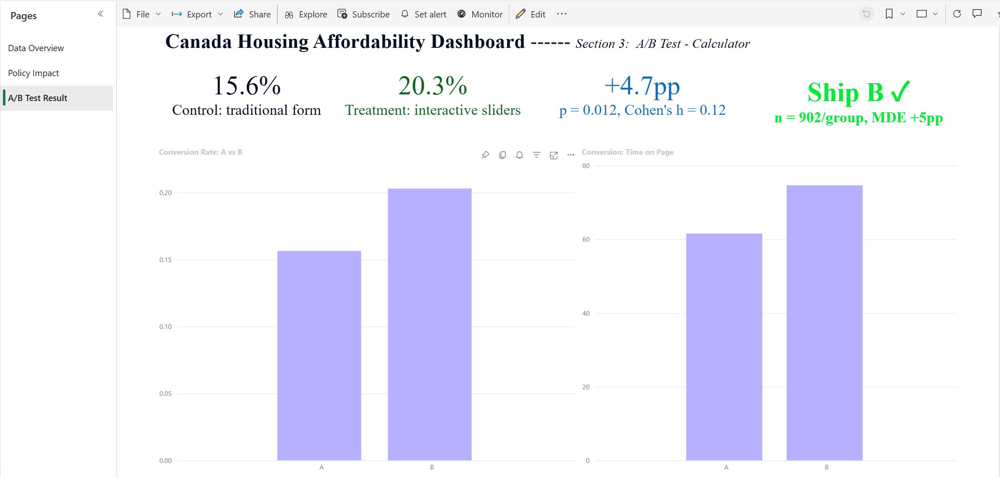

# Canada Housing Affordability Analysis

> This is an end-to-end data analytics project which quantifies the 
> impact of British Columbia's 2018 Speculation and Vacancy Tax 
> on Vancouver rental prices. Additionally, I also designed an integrated A/B testing framework 
> for a simple real-world product UX decisions.


---

## 📊 Live Dashboard



**[ ▶ View Interactive Dashboard on Power BI Service](https://app.powerbi.com/groups/me/reports/d18831b6-e2e0-43d4-9aec-51913d878bb1/beccf6fb82950b24c460?experience=power-bi)**

---

## 🎯 What Is the Purpose of this Project ?

This project mainly answers two real-world business questions 
by using Canadian housing market data:

1. **Did BC's 2018 Speculation and Vacancy Tax actually constrain Vancouver rent growth?**
   - Applied **Difference-in-Differences (DiD)** regression
   - Used 4 control cities (Toronto, Ottawa, Montréal, Calgary)
   - Controlled for Bank of Canada policy interest rates

2. **Which version of a hypothetical CMHC affordability UI should we adopt?**
   - Designed an A/B testing framework with proper power analysis
   - Applied chi-square test (conversion) and t-test (engagement)
   - Computed effect sizes and confidence intervals

---

## 🔑 Key Findings

### Finding 1: BC Tax Did NOT Constrain Vancouver Rents



| Metric | Value | Interpretation                              |
|--------|-------|---------------------------------------------|
| DiD Coefficient | **+$236/month** | Vancouver grew *faster* than counterfactual |
| P-value | 0.007 | Highly statistically significant            |
| 95% CI | [+$66, +$406] | Entirely above zero                         |
| Sample | 340 observations (2009-2025) | 5 cities × 4 unit types × 17 years          |

**Interpretation:** Contrary to policy intent, Vancouver rents grew approximately **$236/month faster** 
than the control group's counterfactual after 2018. 
This does NOT prove the policy caused inflation—rather, 
stronger macro forces (post-pandemic(COVID-19), migration, capital flows) 
likely overwhelmed any dampening effect the tax might have had.

### Finding 2: A/B Test Recommends Adopting Version B



| Metric | Group A | Group B | Lift | P-value | Effect Size |
|--------|---------|---------|------|---------|-------------|
| Conversion Rate | 15.6% | 20.3% | **+4.7pp** (+29.8%) | 0.012 | Cohen's h = 0.12 (Small) |
| Time on Page | 61.6s | 74.7s | **+13.1s** (+21.3%) | <0.0001 | Cohen's d = 0.58 (Large) |

**Decision:** Adopt Version B. Both primary (conversion) and secondary (engagement) metrics show statistically significant improvements, with conversion lift's confidence interval entirely above zero. The larger engagement effect (Cohen's d=0.58) suggests Version B drives meaningful exploration—next iteration should improve CTA to convert engagement into completions.

---

## 🛠 Tech Stack

| Layer | Tools                                               |
|-------|-----------------------------------------------------|
| **Languages** | Python, SQL Language                                |
| **Database** | PostgreSQL 17 with star schema                      |
| **Data Sources** | Statistics Canada WDS API, Bank of Canada Valet API |
| **Python Libraries** | pandas, sqlalchemy, statsmodels, scipy, matplotlib  |
| **BI / Visualization** | Power BI Desktop + Power BI Service                 |
| **Version Control** | Git, GitHub                                         |

---

## 🗂 Project Structure

```
canada-housing-affordability/
├── README.md
├── notebooks/
│   └── 01_data_exploration.ipynb     # Full analysis: EDA, DiD, A/B test
├── src/
│   ├── db_utils.py                    # PostgreSQL connection helpers
│   └── data_pipeline.py               # Reusable ETL pipeline (one-command refresh)
├── sql/
│   └── 01_create_schema.sql           # Star schema DDL
├── data/
│   └── processed/
│       └── ab_test_data.csv           # Simulated A/B test data
├── docs/
│   └── screenshots/                   # Dashboard screenshots
├── Canada_Housing_Dashboard.pbix      # Power BI dashboard (3 pages)
├── requirements.txt                   # Python dependencies
└── .gitignore
```

---

## 🏗 Data Model (Star Schema)

The PostgreSQL warehouse follows a classic star schema design:

```
                  dim_time (20 rows)
                       │
                       │
   dim_city (5)────fact_rent (400)────dim_property_type (4)
                       │
                       │
              analytical_dataset (400)
              (denormalized data mart with policy rates joined)
```

- **Fact table:** `fact_rent` stores rental observations indexed by city × time × unit type
- **Dimensions:** `dim_city`, `dim_time`, `dim_property_type`
- **Data mart:** `analytical_dataset` is a materialized view denormalizing fact with year and Bank of Canada policy rates for downstream analysis

---

## 🚀 How to Run

### Prerequisites

- Python 3.12+
- PostgreSQL 17 (running locally)
- Power BI Desktop (Windows only, for opening `.pbix`)

### Setup

```bash
# 1. Clone the repo
git clone https://github.com/ABswh17/canada-housing-affordability.git
cd canada-housing-affordability

# 2. Create virtual environment
python -m venv .venv
.venv\Scripts\activate              # Windows
# source .venv/bin/activate          # macOS/Linux

# 3. Install dependencies
pip install -r requirements.txt

# 4. Set up environment variables
# Create .env file in project root:
echo DB_HOST=localhost > .env
echo DB_PORT=5432 >> .env
echo DB_NAME=canada_housing >> .env
echo DB_USER=postgres >> .env
echo DB_PASSWORD=your_password_here >> .env

# 5. Create schema in PostgreSQL
psql -U postgres -d canada_housing -f sql/01_create_schema.sql

# 6. Run the full ETL pipeline (one command)
python src/data_pipeline.py
```

### Re-running Analysis

```bash
# Open the notebook to walk through DiD + A/B testing
jupyter notebook notebooks/01_data_exploration.ipynb

# Open the Power BI dashboard
# Double-click Canada_Housing_Dashboard.pbix
```

---

## 📈 Methodology

### Difference-in-Differences (DiD)

**Research design:**
- **Treatment group:** Vancouver (subject to 2018 BC Speculation and Vacancy Tax)
- **Control group:** Toronto, Ottawa, Montréal, Calgary 
- **Pre-period:** 2009-2017
- **Post-period:** 2018-2025

**Model specification:**

```
avg_rent_cad ~ treatment_group 
             + post_2018 
             + treatment_group × post_2018      # DiD estimator
             + avg_policy_rate                   # control variable
```

**Parallel trends assumption:** Visually validated for 2009-2017 — both treatment and control groups show similar rent growth patterns before the policy intervention.

### A/B Testing

**Scenario:** CMHC Housing Affordability Calculator UI redesign
- **Version A:** Traditional form (text inputs + dropdowns)
- **Version B:** Interactive sliders with real-time feedback

**Statistical design:**
- **Power analysis:** α = 0.05, statistical power = 0.80, MDE = +5pp
- **Required sample size:** 902 per group (1,804 total)
- **Tests:**
  - Chi-square test for conversion rates (categorical outcome)
  - Independent t-test for time on page (continuous outcome)
- **Effect sizes:** Cohen's h for proportions, Cohen's d for means
- **Confidence intervals:** Wilson method for proportions, standard t-based for means

---

## ⚠️ Limitations & Future Work

This project is intentionally scoped for a portfolio demonstration. Known limitations:

- **DiD model:** Does not yet include city fixed effects or clustered standard errors. The +$236 estimate is robust to interest rate controls but could be refined with more advanced econometric techniques.
- **Pre-policy window:** Bank of Canada V39079 series only starts from 2009, so pre-policy macro controls are limited to 2009-2017.
- **A/B test data:** Simulated using realistic industry parameters; no real user data was used.
- **Coverage:** 5 cities only (Vancouver, Toronto, Ottawa, Montréal, Calgary) — expansion to all CMA-level metros possible.

---

## 📚 Data Sources

1. **Statistics Canada Table 34-10-0133-01** — Canadian Mortgage and Housing Corporation rental statistics
   - API: https://www150.statcan.gc.ca/t1/wds/rest
   - License: Statistics Canada Open License

2. **Bank of Canada V39079 Series** — Overnight Rate Target (Policy Interest Rate)
   - API: https://www.bankofcanada.ca/valet/
   - License: Bank of Canada Open License

---

## 📬 Contact

**Weihao (William) Sun**
- 📧 Email: Utopiatozoo@outlook.com
- 💼 LinkedIn: http://www.linkedin.com/in/weihao-sun-9a472a397
- 🐙 GitHub: [@ABswh17](https://github.com/ABswh17)

---

## 📄 License

This project is licensed under the MIT License — see the [LICENSE](LICENSE) file for details.
